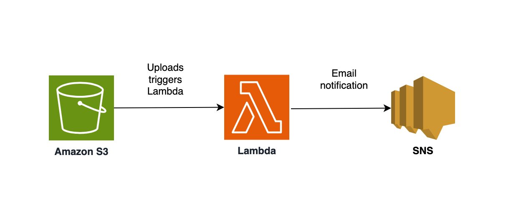

# AWS Lambda triggered by S3 to process ‘Word Count’and notify via SNS #

## Project Description

This project showcases the power of AWS Serverless Computing by automating word count
processing using **AWS Lambda**. Each time a text file is uploaded to an **Amazon S3** bucket, an **AWS Lambda** function is triggered to count the number of words in the file. The result is then sent via email using **Amazon Simple Notification Service (SNS)**.

## Architecture Overview

## Technologies Used

* **AWS Lambda**: Python-based function execution.
* **Amazon S3**: Storage for text files triggering Lambda execution.
* **Amazon SNS**: Notification service for email alerts.
* **https://app.diagrams.net**: Architecture diagram.

## Complete Project

## Acknowledgments

- AWS re/Start / Factoría F5 mentoring
- AWS Documentation and Best Practices
- Open source tools that make database migrations possible
